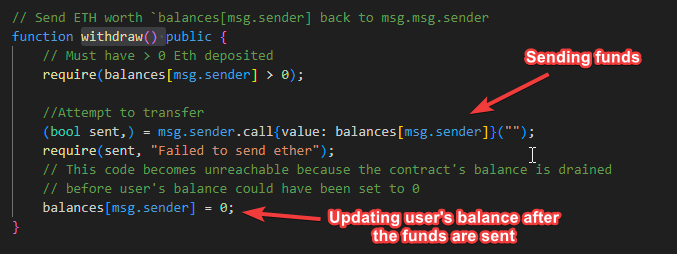

# Re-entrancy

This repo is created by following the Re-entrancy lesson on LearnWeb3 (https://learnweb3.io/degrees/ethereum-developer-degree/senior/the-bug-which-cost-ethereum-60-million-dollars-re-entrancy/)

## Introduction

Re-Entrancy is the vulnerability in which if Contract A calls a function in Contract B, Contract B can then call back into Contract A while Contract A is still processing. This can lead to some serious vulnerabilities in Smart contracts, often creating the possibility of draining funds from a contract.

Consider a scenario where contract A is sending funds to Contract B before updating the balance of Contract B. If Contract B was to create a fallback() or receive() function in it's contract, which would execute when it received ETH, it could call the funds sending function in Contract A again. In our repo, the withdraw() function in Contract A (GoodContract) is responsible for sending the funds.



# Getting Started 
The repo has two contracts. 
- GoodContract - Contract A
- BadContract - Contract B


## Requirements

- [git](https://git-scm.com/book/en/v2/Getting-Started-Installing-Git)
  - You'll know you did it right if you can run `git --version` and you see a response like `git version x.x.x`
- [foundry](https://getfoundry.sh/)
  - You'll know you did it right if you can run `forge --version` and you see a response like `forge 0.2.0 (816e00b 2023-03-16T00:05:26.396218Z)`

## Installation

```bash
git clone https://github.com/SajidSheikh87/LW3-re-entrancy
cd LW3-re-entrancy
```

# Testing

## Vanilla Foundry

```bash
foundryup
forge test
```